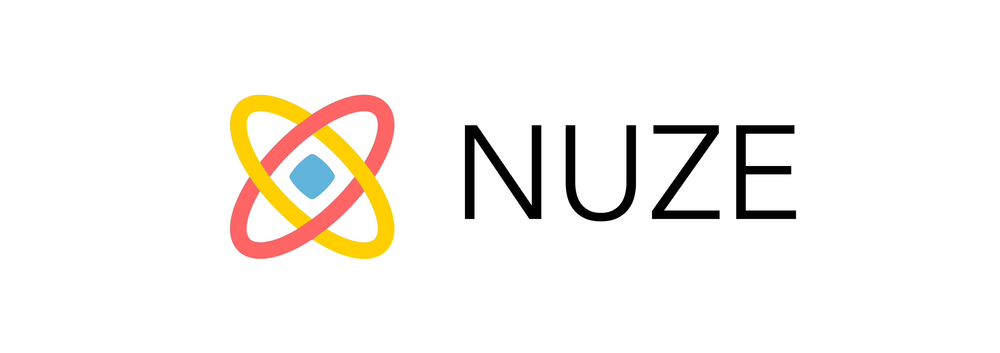
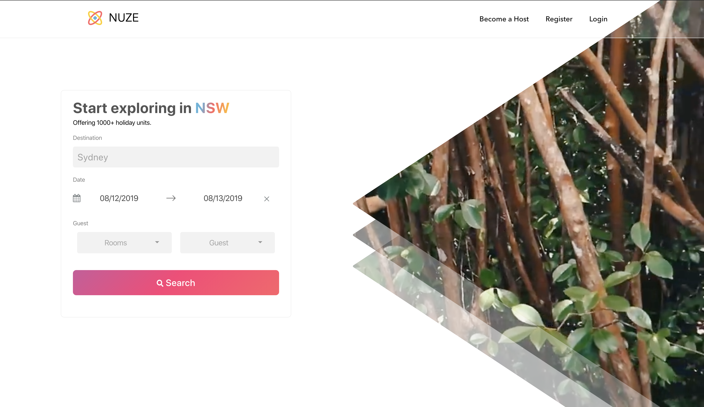

# 💻 [NUZE](http://nuze.xyz) - Support Crypto Payment Airbnb

**Official website: [http://nuze.xyz](http://nuze.xyz)**

## 🏄 Team Progress

1. The [Trello Board](https://trello.com/b/GltF0JUS) can be found in this link.
2. Our weekly report is updated under the dairy folder.

## 🍦 Getting Started

1. To run website using this command line`cd Web && yarn && npm start`

## 🍕 Snapshot

## 👻 Team Members

- [lmcmz](https://github.com/lmcmz)
- [Joannazhx](https://github.com/Joannazhx)
- [meilixiaozhang](http://github.com/meilixiaozhang)
- [Michael](http://github.com/MichaelH-au)

## License
